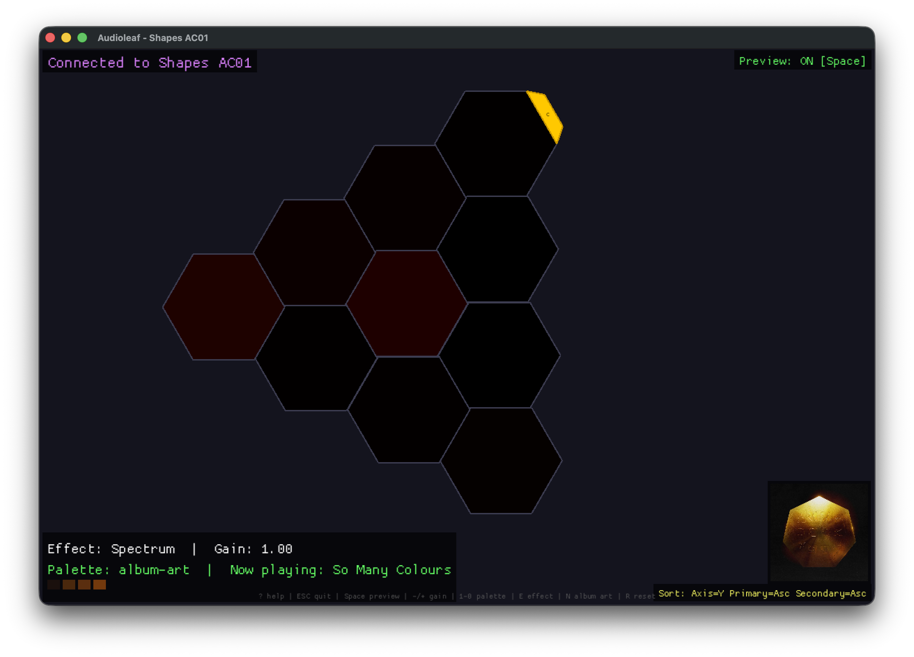
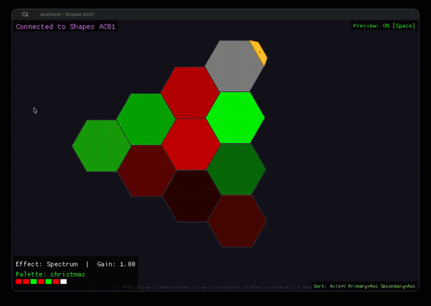

# Audioleaf

A real-time music visualizer for Nanoleaf devices (Shapes, Canvas, Elements, and Light Panels). Audioleaf listens to your system audio, analyzes it, and drives your Nanoleaf panels with reactive color animations — all rendered in a graphical window that mirrors your physical panel layout.





> **Note:** This is a fork with macOS compatibility fixes, a graphical UI, album art integration, and support for all Nanoleaf device types. See [CHANGELOG.md](CHANGELOG.md) for details.

## Features

- **Real-time audio visualization** — Three effects (Spectrum, Energy Wave, Pulse) that react to your music
- **Graphical panel preview** — See your exact Nanoleaf layout rendered on screen with live color preview
- **Album art integration** — Automatically extract color palettes from the currently playing track's album artwork (Spotify & Apple Music)
- **11 built-in color palettes** — From ocean-nightclub to neon-rainbow, plus custom RGB palettes
- **Panel sorting controls** — Adjust how colors map to your physical layout
- **Cross-platform** — macOS and Linux

## Installation

Install from cargo:

```bash
cargo install audioleaf
```

Make sure `$HOME/.cargo/bin` is in your `$PATH`.

For Arch-based distros, audioleaf is also available in the [AUR](https://aur.archlinux.org/packages/audioleaf):

```bash
yay -S audioleaf
```

## Usage

### First-Time Setup

At first launch, audioleaf discovers Nanoleaf devices on your local network:

```bash
audioleaf -n
```

This will:

1. Scan your network for Nanoleaf devices
2. Display discovered devices
3. Prompt you to put your device in pairing mode (hold power button until LEDs flash)
4. Save the device configuration

**Device data location:**

- **macOS**: `~/Library/Application Support/audioleaf/nl_devices.toml`
- **Linux**: `~/.config/audioleaf/nl_devices.toml`
- **Custom**: Use `--devices /path/to/devices.toml`

### Running

After setup, simply run:

```bash
audioleaf
```

To connect to a specific device:

```bash
audioleaf -d "Shapes AC01"
```

### Web Control Panel (Axum + React)

Audioleaf now includes an HTTP API and a Vite/React control panel scaffold.

Start the API server:

```bash
cargo run --bin audioleaf-api
```

The API process also starts a live visualizer engine (using your saved config), so web effect/palette/settings changes apply to panels immediately. Web updates modify the running state and are not auto-written to `config.toml`.

In a second terminal, start the web app:

```bash
cd web
pnpm install
pnpm dev
```

The Vite dev server runs at `http://127.0.0.1:5173` and proxies `/api/*` to `http://127.0.0.1:8787`.

Current API routes:

- `GET /api/health`
- `GET /api/config`
- `POST /api/config/save` (persist current runtime config to `config.toml`)
- `PUT /api/config/visualizer/effect` (`effect`: Spectrum | EnergyWave | Pulse)
- `PUT /api/config/visualizer/palette` (`palette_name`: preset name)
- `PUT /api/config/visualizer/sort` (`primary_axis`, `sort_primary`, `sort_secondary`)
- `PUT /api/config/visualizer/settings` (`audio_backend`, `freq_range`, `default_gain`, `transition_time`, `time_window`)
- `GET /api/now-playing` (latest Shairport track metadata + extracted artwork colors)
- `PUT /api/now-playing/settings` (`drive_visualizer_palette`)
- `GET /api/now-playing/artwork` (latest album artwork image bytes)
- `GET /api/visualizer/preview` (live panel colors from running visualizer)
- `GET /api/audio/backends`
- `GET /api/devices`
- `GET /api/devices/{name}/info`
- `GET /api/devices/{name}/layout`
- `PUT /api/devices/{name}/state` (`power_on` and/or `brightness` 0-100)
- `GET /api/palettes`

#### Shairport Sync Metadata Setup

To power the web "Now Playing" panel from AirPlay metadata, enable metadata in `shairport-sync.conf`:

```conf
metadata =
{
  enabled = "yes";
  include_cover_art = "yes";
  pipe_name = "/tmp/shairport-sync-metadata";
};
```

If you use a different metadata pipe path, set:

```bash
export AUDIOLEAF_SHAIRPORT_METADATA_PIPE=/absolute/path/to/your/pipe
```

before starting `audioleaf-api`.

### Controls

Press <kbd>?</kbd> in the app to see all keybinds.

| Key | Action |
| --- | --- |
| <kbd>Esc</kbd> / <kbd>Q</kbd> | Quit |
| <kbd>?</kbd> | Toggle help overlay |
| <kbd>Space</kbd> | Toggle live panel color preview |
| <kbd>-</kbd> / <kbd>+</kbd> | Decrease / increase gain (visual sensitivity) |
| <kbd>1</kbd>-<kbd>9</kbd>, <kbd>0</kbd> | Switch color palette |
| <kbd>E</kbd> | Cycle effect: Spectrum / Energy Wave / Pulse |
| <kbd>A</kbd> | Toggle primary sort axis (X / Y) |
| <kbd>P</kbd> | Toggle primary sort (Asc / Desc) |
| <kbd>S</kbd> | Toggle secondary sort (Asc / Desc) |
| <kbd>N</kbd> | Use album art colors from current track |
| <kbd>R</kbd> | Reset all panels to black |

### Effects

- **Spectrum** — Each panel tracks a frequency band. Bass on one end, treble on the other.
- **Energy Wave** — Audio energy cascades across panels as a traveling ripple.
- **Pulse** — All panels pulse together, driven by audio transients. Snaps to the beat.

## Configuration

Configuration lives in `config.toml`:

- **macOS**: `~/Library/Application Support/audioleaf/config.toml`
- **Linux**: `~/.config/audioleaf/config.toml`
- **Custom**: Use `--config /path/to/config.toml`

A default config file is generated on first launch.

### Example Configuration

```toml
default_nl_device_name = "Shapes AC01"

[visualizer_config]
# Audio input device (see Audio Setup below)
audio_backend = "default"

# Frequency range to visualize [min_hz, max_hz]
freq_range = [20, 4500]

# Color palette — named palette or custom RGB array
# Named: "ocean-nightclub", "sunset", "fire", "forest", "neon-rainbow", etc.
colors = "ocean-nightclub"
# Or custom RGB: colors = [[255, 0, 128], [0, 128, 255], [128, 255, 0]]

# Audio sensitivity (doesn't affect playback volume)
default_gain = 1.0

# Panel transition speed in 100ms units (2 = 200ms)
transition_time = 2

# Audio sampling window in seconds
time_window = 0.1875

# Panel sorting
primary_axis = "Y"        # "X" or "Y"
sort_primary = "Asc"      # "Asc" or "Desc"
sort_secondary = "Asc"    # "Asc" or "Desc"

# Visualization effect
effect = "Spectrum"        # "Spectrum", "EnergyWave", or "Pulse"
```

### Available Palettes

| Palette | Description |
| --- | --- |
| `ocean-nightclub` | Deep blues, purples, teals |
| `sunset` | Warm oranges, reds, pinks |
| `house-music-party` | Energetic magentas, purples, cyans |
| `tropical-beach` | Turquoise, aqua, lime |
| `fire` | Reds, oranges, yellows |
| `forest` | Deep greens, yellow-green |
| `neon-rainbow` | Full spectrum |
| `pink-dreams` | Soft pinks through magentas |
| `cool-blues` | Ice blues to navy |
| `tmnt` | Turtle green + bandana colors |
| `christmas` | Red, green, white |

## Audio Setup

### macOS

1. Install [BlackHole](https://existential.audio/blackhole/) (free virtual audio device)
2. Open **Audio MIDI Setup** (Applications > Utilities)
3. Create a **Multi-Output Device** including your speakers + BlackHole 2ch
4. Set the Multi-Output Device as your system output
5. Set `audio_backend = "BlackHole 2ch"` in config.toml

**Tip**: Target `"BlackHole 2ch"` directly, not the Multi-Output Device aggregate. This provides proper audio levels with `default_gain = 1`.

### Linux (PulseAudio/PipeWire)

1. Run audioleaf
2. Open `pavucontrol` (PulseAudio Volume Control)
3. In the **Recording** tab, set audioleaf's input to your media player's monitor
4. Set `audio_backend` in config.toml to match

### Raspberry Pi (ALSA Loopback, Recommended)

For AirPlay + live visualizer on Raspberry Pi, use ALSA loopback and keep audioleaf on
`audio_backend = "default"` so ALSA routing is the single source of truth.

1. Load/persist loopback:
   ```bash
   sudo modprobe snd-aloop
   echo snd-aloop | sudo tee /etc/modules-load.d/snd-aloop.conf
   echo "options snd-aloop id=Loopback index=2 pcm_substreams=8" \
     | sudo tee /etc/modprobe.d/snd-aloop.conf
   ```
2. Set ALSA default capture mapping in both `/etc/asound.conf` and `~/.asoundrc`:
   ```conf
   pcm.audioleaf_in {
     type plug
     slave.pcm "hw:Loopback,1,0"
   }

   pcm.!default {
     type plug
     slave.pcm "hw:Loopback,1,0"
   }
   ```
3. Configure `shairport-sync` to output to loopback playback:
   ```conf
   general = {
     output_backend = "alsa";
   };

   alsa = {
     output_device = "hw:Loopback,0,0";
     output_rate = 44100;
     output_format = "S16_LE";
     output_channels = 2;
     use_mmap_if_available = "no";
   };

   metadata = {
     enabled = "yes";
     include_cover_art = "yes";
     pipe_name = "/tmp/shairport-sync-metadata";
   };
   ```
4. Keep audioleaf backend on default and persist:
   ```bash
   curl -sS -X PUT http://127.0.0.1:8787/api/config/visualizer/settings \
     -H 'content-type: application/json' \
     -d '{"audio_backend":"default"}'
   curl -sS -X POST http://127.0.0.1:8787/api/config/save
   ```

## Dump Commands

Inspect your device without launching the full app:

```bash
# Show panel layout info
audioleaf dump layout

# Interactive graphical layout view (click panels to flash them)
audioleaf dump layout-graphical

# List available color palettes
audioleaf dump palettes

# Show raw device info
audioleaf dump info
```

## Troubleshooting

### Visualizer Not Responding

1. **Check audio routing** — Verify audioleaf receives audio input (use `pavucontrol` on Linux, check Multi-Output Device on macOS)
2. **Adjust gain** — Press <kbd>+</kbd>/<kbd>-</kbd> in the app, or set `default_gain` in config
3. **Adjust frequency range** — Try `freq_range = [20, 500]` for bass-heavy, `[20, 4500]` for full range

### Device Not Discovered

1. Ensure device is powered on and on the same network
2. Check firewall isn't blocking SSDP/UDP multicast
3. Try `audioleaf -n` to re-discover

### Brightness

Brightness is controlled by your Nanoleaf device settings (mobile app or physical buttons), not by audioleaf. The visualizer dynamically adjusts color intensity based on audio.

## Contributing

Feel free to open a pull request or start a GitHub issue. Contributions welcome!
